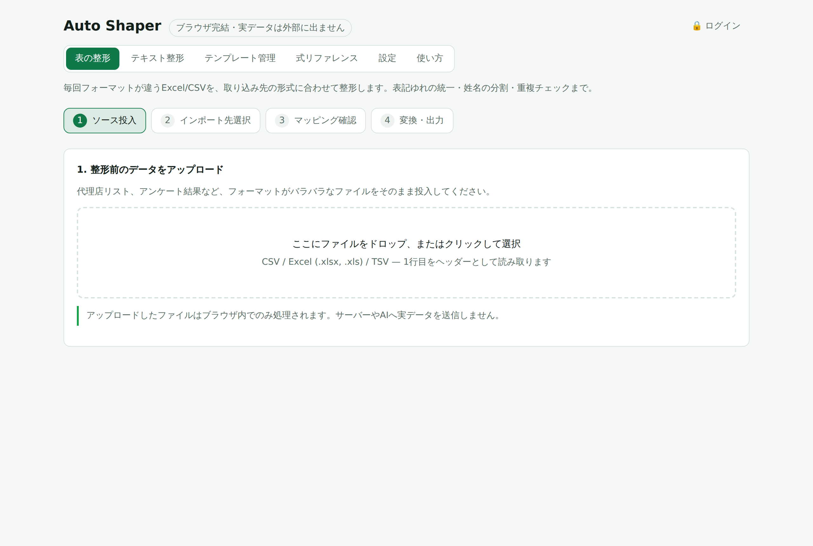
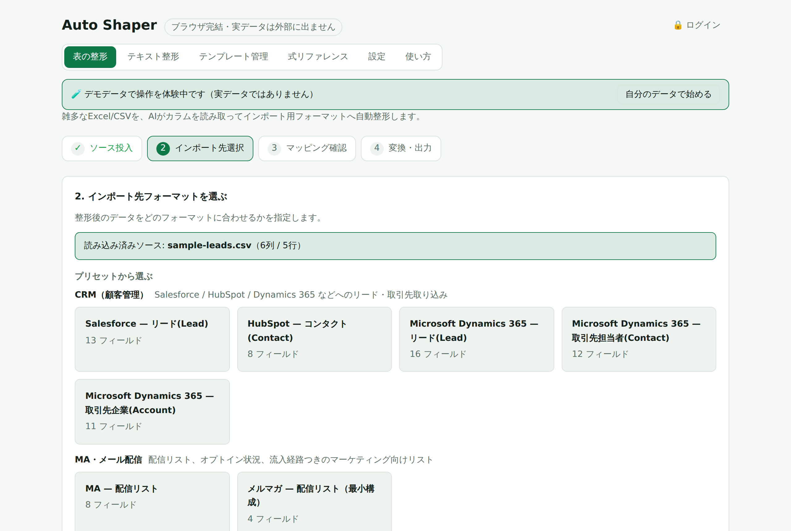
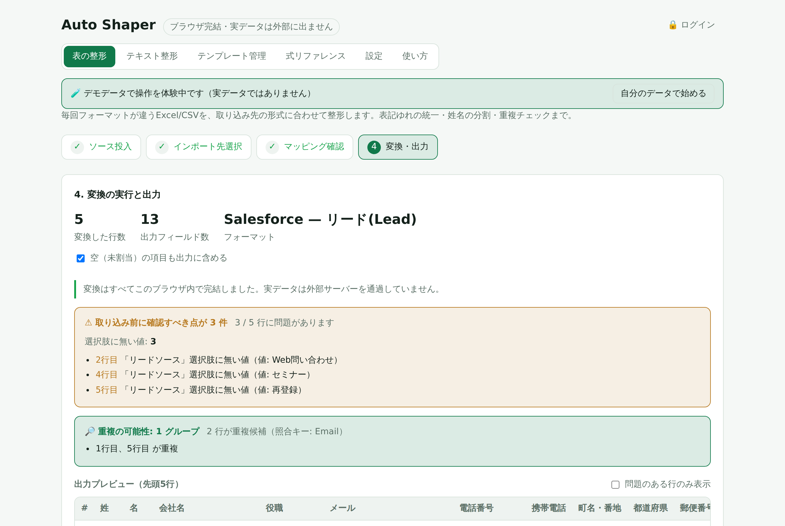
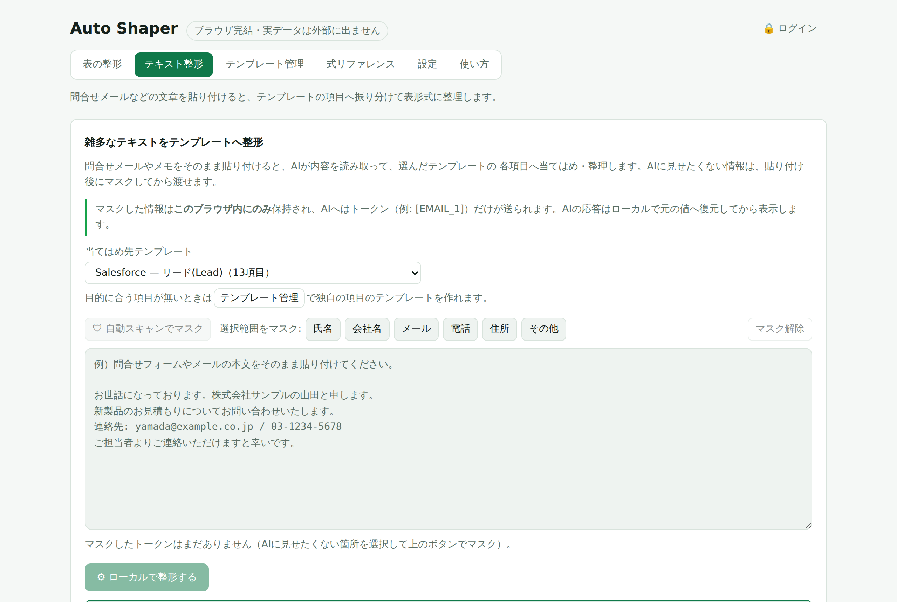
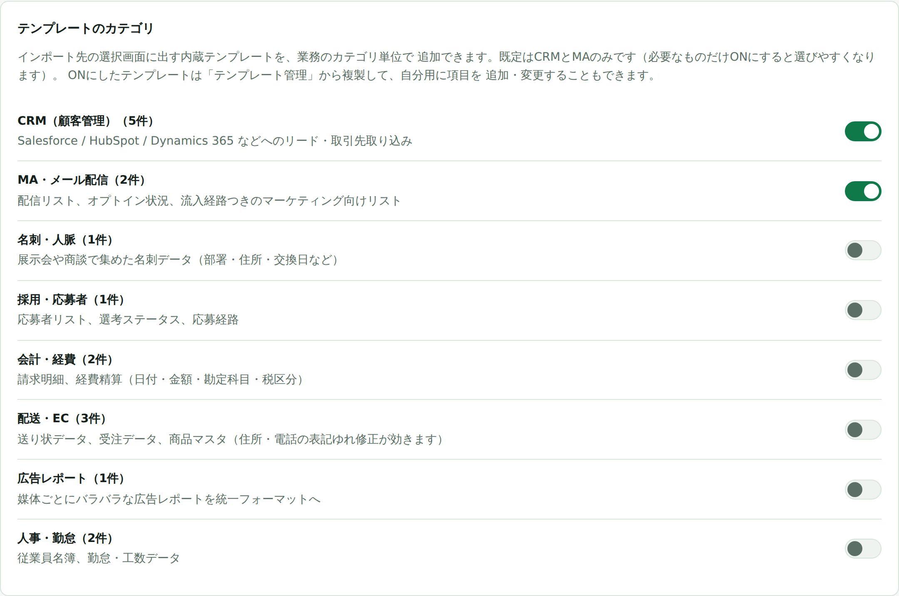
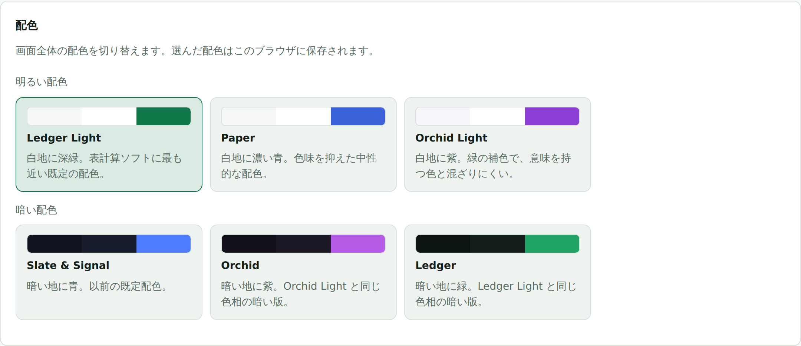

# Auto Shaper

毎回フォーマットが違う Excel/CSV を、**取り込み先の形式に合わせて整形する**ブラウザツール。

**▶ [https://auto-shaper.web.app](https://auto-shaper.web.app) で今すぐ試せます**（インストール不要・ログイン不要）

CRM(Salesforce / HubSpot 等)への取り込み前に毎回発生する、代理店リストやアンケート結果の
整形作業 — 列の並べ替え、全角半角の直し、`(株)` の表記統一、氏名の分割、重複チェック — を
まとめて片付けるためのツールです。**XLOOKUP と置換を繰り返す手作業**の置き換えを狙っています。

一度決めた列の対応付けは保存でき、翌月に同じ形のファイルが来たらワンクリックで再適用できます。

[](https://auto-shaper.web.app)

2 つのモードがあります。

- **表の整形**: 雑多な Excel/CSV を、取り込み用フォーマットへ整形して CSV/Excel で書き出します。
- **テキスト整形**: 問合せメールなどの**文章をコピペ**すると、選んだテンプレートの項目へ
  振り分けて 1 行のレコードに整理します。

## 画面イメージ

初回アクセス時はサンプルデータを使ったガイドツアーが出るので、手を動かしながら 4 ステップを試せます。

| 1. ソース投入                                  | 2. インポート先を選ぶ                                              |
| ---------------------------------------------- | ------------------------------------------------------------------ |
|  |             |
| 雑多な CSV/Excel をドロップするだけ            | 用途別のテンプレートから選択（独自フォーマットのアップロードも可） |

| 3. マッピングを確認                                                              | 4. 変換して出力                                                 |
| -------------------------------------------------------------------------------- | --------------------------------------------------------------- |
|                                     |                           |
| 自動割り当ての結果を**確信度つき**で表示。変換前後をプレビューしながら修正できる | 必須欠落・形式不正・**重複候補**を検出してから CSV/Excel で出力 |

| テキスト整形モード                                           | テンプレートのカテゴリ                                              |
| ------------------------------------------------------------ | ------------------------------------------------------------------- |
|               |    |
| 問合せメールを貼り付け → マスキング → テンプレート形式へ整理 | CRM/MA のほか、会計・配送・広告・人事など**8 カテゴリ 17 種**を用意 |

配色は設定から切り替えられます（明るい 3 種・暗い 3 種）。



## コンセプト

- **ブラウザ完結**: 実データはあなたのブラウザから外に出ません。パースも変換も CSV 出力もすべてローカル。
- **整形処理にネットワークは不要**: 列の対応付けの判定も、全行の変換も、ローカルの
  ルールエンジンが実行します。**既定では外部と一切通信しません**（オフラインでも動きます）。
- **確認してから実行**: 自動で割り当てた結果を確信度つきで表示し、変換前後をプレビュー。
  人が確認・修正してから全件に適用します。
- **堅牢な JSON ルールエンジン**: `eval` などの動的コード実行は使わず、表現力を
  「1対1 / 結合 / 分割 / 固定値 / 条件分岐 + 正規化」に限定してデータ破損リスクを排除しています。
- **AI は任意の補助**: 列名が独特で自動判定が外れるときだけ、LLM を有効にすると精度を補えます。
  **既定は OFF** で、使わなくても全機能が動きます（詳細は「主な機能」の LLM 推論）。

## 主な機能

すべて「設定」ページで個別にON/OFFできます。

- **見出し行の自動判定**: 1行目がタイトルや注記で、実際の見出しが数行下にある業務Excelを
  そのまま読めます。判定が外れた場合はプレビューから見出し行を選び直せます。
- **複数ファイル/シートの結合**: 月ごとに分かれたファイルや、支店ごとのシートを
  **まとめて投入すると縦につないで1つの表として整形**します。取込元(ファイル名/シート名)を
  列として残すこともできます。
- **表記ゆれの正規化**: 全角/半角の統一、`(株)`→`株式会社`、電話番号のハイフン統一、
  メールの小文字化に加え、**日付**(`2024/1/5` `令和6年1月5日` `45296` → `2024-01-05`)と
  **数値**(`¥1,000` `(1,000)` → `1000` `-1000`)の統一を項目ごとに指定できます。
- **列の組み替え**: 1対1の割り当てのほか、`氏名`→姓/名の**分割**、複数列の**結合**、固定値、
  条件分岐に対応します。
- **値の対応表**: `東京都`→`13`、`済`→`TRUE` のように値そのものを置き換えます。元データに
  出てくる値から候補を起こせます（照合は空白・全角半角・英字の大小を無視）。
- **行の絞り込み**: 「状態が解約の行は除く」のように、変換の前に対象の行を間引けます。
- **マッピングの記憶(レシピ)**: 確定したマッピングを保存し、同じ列構成のファイルが来たら**ワンクリックで再適用**。
  毎月届く同じ代理店フォーマットの取り込みを一撃で終わらせます。参照テーブルの突き合わせ方と
  重複の設定も一緒に覚えます。**ファイルの中身は保存しません**（実データを保存しない方針のため）。
  適用時は「この参照ファイルを入れてください」と促し、投入した時点で覚えていた設定のまま復元します。
- **マスキング**: 外部に送る場合に備え、氏名・会社名・メール・電話・住所など**個人情報の列を自動判定して伏字化**。
  追加でマスクしたい列も指定できます。「サンプル値を一切送らず列名だけ」の最強モードも選べます。
- **LLM推論（任意・既定OFF）**: 列名が独特で自動判定が外れるときの補助。設定でAPIキー
  (**Anthropic / OpenAI / Google Gemini**)を入れると、割り当ての推論だけをLLMに任せられます。
  送るのは**マスキング済みのカラム名とサンプルのみ**で、実データの変換は変わらずローカルです。
  **利用にはログインが必要**（運営のサーバー費用を無関係な第三者の連打から守るための制限。
  未ログイン時・失敗時はローカル推論に自動フォールバック）。
  なお、プロバイダへの接続はブラウザからではなく**バックエンド経由**で行うため、
  **入力した API キーはリクエストごとに API サーバーへ送信されます**（詳細は
  [「LLM の API キーが通る経路」](#llm-の-api-キーが通る経路)）。
- **固定値・選択肢・既定値**: テンプレートの各項目に「選択可能な固定値の候補」と「既定値」を設定できます。
  元データに対応列が無い項目は**既定値が自動で入り**、マッピング画面でプルダウン選択や自由入力で上書きできます。
- **ログイン(任意)とDB保存**: ログインしなくても使えます。ログインすると、テンプレートとマッピング(レシピ)が
  **サーバー(DB)にユーザー単位で保存**され、複数端末で共有できます（未ログイン時はブラウザの localStorage）。
- **学習辞書**: あなたがマッピングを直した履歴(列名→項目)を蓄積し、次回以降の自動割り当ての精度を上げます。
- **取り込み前の検証**: 変換後に必須欠落・メール/電話の形式不正・選択肢に無い値・**文字数の上限超過**を
  検出し、該当行をハイライト。文字数上限はテンプレートの項目ごとに設定できます
  （取り込み先が1件でも超えるとインポート全体を失敗させることがあるため）。
- **参照テーブル（横引き）**: 別ファイルをキーで突き合わせ、必要な列だけを取り込みます
  （XLOOKUP と同じ意味論なので **行数は増えません**）。「一致した行を除く / だけ残す」を
  選べるので、**既に取り込み済みのリストと突き合わせて新規だけを出す**差分抽出も同じ画面で行えます。
- **重複検出・名寄せ**: 照合キーを選び、見つけたら「知らせるだけ / 最初(最後)の1行を残す /
  **1行に統合**」から選べます。統合は項目ごとに空でない値を拾うので、別々のリストにしか
  入っていなかった電話番号や役職がまとまります。統合前後はその場で確認できます。
- **配色の切り替え**: 明るい配色 3 種・暗い配色 3 種から選べます（既定は白地に深緑の
  `Ledger Light`）。配色は `src/styles.css` の `[data-theme]` にトークンでまとめてあるので、
  独自の配色を追加する場合もそこに 15 個の基準色を足すだけです（`src/core/theme.ts` に登録）。

## 使い方(操作フロー)

1. **ソース投入** — 整形前の CSV/Excel をドロップ（複数まとめて投入すると縦に結合）
2. **インポート先選択** — プリセット(Salesforce Lead / HubSpot Contact)、または独自の
   インポート用シート(ヘッダー行)をアップロード
3. **マッピング確認** — 自動割り当ての結果を確認し、確信度が低い箇所だけ修正。プレビューで整形結果を確認
4. **変換・出力** — 全件をブラウザ内で変換し、整形済み CSV をダウンロード

`samples/messy-leads.csv` を投入 → Salesforce リードを選ぶと動作を試せます。
（全角電話番号の半角化、`(株)`→`株式会社`、`氏名`→姓/名の分割 などが自動提案されます）

## テキスト整形モード（問合せメール等）

ヘッダー「テキスト整形」から使えます。表になっていない**フリーテキスト**を、テンプレート形式へ整理する用途です。

1. **貼り付け** — 問合せメールやメモの本文をテキストエリアにそのままコピペ
2. **マスキング（任意）** — 外部に出したくない箇所を保護します（LLM を使う場合に効きます）
   - **自動スキャン**: メール・電話・カード番号・長い数字列をパターン検出して `[EMAIL_1]` のような
     トークンへ一括置換
   - **選択範囲をマスク**: 氏名・会社名・住所など、選択したテキストを指定カテゴリでトークン化
     （同じ文字列はまとめて置換）
3. **テンプレート選択** — プリセット、または「テンプレート管理」で作った独自項目のテンプレートを選択
4. **整形** — ラベル・パターンによる**ローカル抽出**で各項目へ当てはめて 1 レコードに整理します
   （設定で LLM を有効化している場合は、代わりに LLM が当てはめます）
5. **確認・出力** — 各項目を編集し、テキスト/JSON でコピー、または CSV/Excel でダウンロード

**安全性**: LLM を使う場合でも、送られるのは**マスク済みのテキストだけ**で、元の値はこのブラウザ内の
辞書にのみ残ります。応答に含まれるトークンは、表示・出力の前に**ローカルで元の値へ復元**します（マスキングのロジックは
[Maskify](https://github.com/jantyran/Maskify-ai) を本リポジトリの方針に合わせて移植したものです）。

## 使ってみる

- **公開版**: [https://auto-shaper.web.app](https://auto-shaper.web.app)
  インストール不要・ログイン不要でそのまま使えます（データはブラウザの localStorage に保存）。
  ログインすると、テンプレートとマッピングをサーバー(DB)に保存して複数端末で共有できます。
- **手元で動かす**: 下記の「セットアップ / 開発」で clone して `npm run dev`。
  OSS なので、自分のサーバー・自分の Firebase プロジェクトへデプロイすることもできます。

## セットアップ / 開発

前提: Node.js 22 以上。

```bash
git clone https://github.com/jantyran/auto-shaper.git
cd auto-shaper
npm install

npm run dev          # 開発サーバー(Vite) + API を同梱 → http://localhost:5173
npm run build        # 本番ビルド
npm run preview      # ビルド成果物 + API を同梱 → http://localhost:4173
npm run server       # API を単体で起動(別オリジン配信/本番用・任意) → :8787
npm run server:prod  # ↑ の本番設定版(.env.production を読み込んで起動)
```

**`npm run dev` / `npm run preview` は API を同一オリジンに同梱**しています（Vite に in-process で
マウント。`vite.config.ts` の `auto-shaper-inprocess-api` プラグイン）。そのため**これ単体で
ログインまで動きます** — 別プロセスや proxy、CORS 設定は不要です。設定ページの「アカウント」から
ログインすると、テンプレート/レシピが DB(既定は SQLite)に**ユーザー単位で保存**され複数端末で
共有できます。ログインしなければ localStorage 保存でそのまま使えます。

`npm run server` は、フロントを**別オリジン(Live Server 等)や別ホスト/本番**で配信する場合に、
API を単体で(:8787)立てるためのものです（この場合はアプリの「APIサーバーURL」設定が必要 →
下記）。DBを差し替える場合は `DB_DRIVER` 環境変数と `server/storage/` を参照。

### 環境変数

`.env.example` が OSS 向けのテンプレートです(値は未設定のままコミットされています)。
自分の環境で使う場合はコピーして値を入れてください。

```bash
cp .env.example .env.production   # 本番用。.gitignore 対象なのでコミットされない
npm run server:prod               # .env.production を読み込んで起動(Node の --env-file)
```

- `.env`(任意)は `npm run server` が自動で読み込みます(存在しなくてもエラーになりません)。
  postgres ドライバをローカルで試す場合などに使います。
- `.env.production` は `npm run server:prod` が読み込みます。**Firebase Cloud Functions への
  デプロイではこのファイルは使いません**(`DATABASE_URL` は Secret Manager 経由で渡します。
  後述の「Firebase(Hosting + Cloud Functions)へのデプロイ」参照)。
- `npm run dev` / `npm run build` / `npm run preview`(Vite)は `VITE_` 接頭辞の変数だけを
  `.env` / `.env.production` などから自動で読み込みます(Vite標準の挙動。追加設定不要)。
- 各変数の意味は `.env.example` のコメントを参照してください
  (`PORT` / `DB_DRIVER` / `DATA_DIR` / `DATABASE_URL` / `CORS_ORIGIN` / `TRUST_PROXY` /
  `VITE_API_BASE`)。

### スクリプト

```bash
npm run typecheck     # 型チェック(tsc)
npm run lint          # ESLint
npm run test          # 変換エンジン/推論/検証のユニットテスト(vitest)
npm run build         # 本番ビルド
npm run format        # Prettier で整形
```

CI(GitHub Actions, `.github/workflows/ci.yml`)で push/PR ごとに
typecheck・lint・test・build を自動実行します。

## OSS として使う

MIT ライセンスの OSS です。[公開版](https://auto-shaper.web.app)をそのまま使うことも、
各自が自分の環境に clone して動かすこともできます。**ログインは任意**で、
しなくてもそのまま使えます（データはブラウザの localStorage に保存）。ログインすると、テンプレートとマッピングを**サーバー(DB)に
ユーザー単位で保存**して複数端末で共有できます。LLM を使う場合の API キーは各自が
ブラウザの設定画面で入力し、**保存先はそのブラウザの localStorage だけ**です（サーバーの DB には
保存しません）。ただし推論の実行時にはキーが API サーバーを経由します — 下記を必ずご確認ください。

改善提案・PR 歓迎です。開発の始め方は [CONTRIBUTING.md](CONTRIBUTING.md)、
脆弱性の報告は [SECURITY.md](SECURITY.md) を参照してください。

### LLM の API キーが通る経路

**LLM 推論・LLM 抽出を有効にすると、入力した API キーはリクエストごとに API サーバーへ
送信されます。** ブラウザから各プロバイダを直接叩くのではなく、`/api/suggest`・`/api/extract`
がキーを受け取ってサーバー側から Anthropic / OpenAI / Gemini へ中継する構成のためです
（`src/core/inference/llm.ts` → `server/suggest.mjs` / `server/extract.mjs`）。

- サーバーはキーを**保存しません**（DB にもファイルにも書かず、リクエスト処理中のみメモリ上に
  存在します）。ログにも出力しません。
- それでも、[公開版](https://auto-shaper.web.app)を使う場合はあなたのキーが**リポジトリ所有者が
  運用するサーバー(Firebase Cloud Functions)を通過する**ことに変わりはありません。これが
  許容できない場合は、自分の環境に clone してセルフホストするか、LLM 推論を OFF のまま
  （既定値）ローカル推論だけで使ってください。全機能はキー無しで動作します。
- セルフホストする場合も、API サーバーを運用する主体が第三者であれば同じことが言えます。
  利用者にはこの経路を明示してください。
- キーは最小権限・使い捨てにし、不要になったら各プロバイダのコンソールで失効させることを
  推奨します。

## ログインとデータ保存(DB / localStorage)

テンプレートとマッピング(レシピ)の保存先は、ログイン状態で切り替わります。

| 状態                                        | 保存先                                                               | 用途                         |
| ------------------------------------------- | -------------------------------------------------------------------- | ---------------------------- |
| **ログイン済み**（+ `npm run server` 起動） | **DB**（既定は SQLite / `server/data/auto-shaper.db`、ユーザー単位） | 複数端末で共有               |
| 未ログイン / サーバーなし                   | ブラウザの **localStorage**                                          | ゼロ設定・オフラインで即利用 |

- **認証**: メール + パスワードの自前バックエンド認証。パスワードは `scrypt` でハッシュ化して
  保存し（平文は保持しない）、ログイン時にセッショントークンを発行して DB に保存します
  （`server/auth.mjs`）。外部サービスや追加依存は使いません。
- **DBの差し替え**: DBアクセスは `server/storage/` のドライバ層に集約しています。環境変数
  `DB_DRIVER` で選択し、既定は **`sqlite`**（`server/storage/sqlite.mjs`、ローカルファイル
  `server/data/auto-shaper.db`）です。個人利用・OSSでのローカル実行はこれが手軽です。
  Cloud Functions / Cloud Run のようにファイルシステムが永続しない環境では **`postgres`**
  （`server/storage/postgres.mjs`、[Neon](https://neon.tech) 等のサーバーレス Postgres 想定、
  `DATABASE_URL` が必要）を使います。どちらも同じ「ストア契約」を実装しているだけなので、
  アプリ側のコードは一切変更不要です。他のDBを使う場合も、同じ契約を満たすドライバを
  追加して `server/storage/index.mjs` の分岐へ接続するだけで差し替えられます。
- **API**: 認証 `POST /api/auth/{signup,login,logout}`・`GET /api/auth/me`、保存系
  `GET/PUT/DELETE /api/schemas`・`/api/collections/:name`（保存系は要ログイン）。
- 保存されるのは**テンプレート定義とマッピングのみ**。顧客の実データは
  サーバーに送られず、ブラウザ内から出ません(アプリの中核方針を維持)。
- 管理ページからテンプレートを **JSON でエクスポート/インポート**できます。書き出すもの・
  取り込むものはダイアログで選べます。インポートは常に**追加**で、既存のテンプレートを
  置き換えることはありません（IDは振り直し、名前が衝突したら `名前 (2)` になります）。

### APIサーバーURLの設定が必要な場合

フロントを Vite 開発サーバーや、API と同一オリジンで配信する場合は設定不要です。
アプリ内の「APIサーバーURL」は空欄のままで、相対パス `/api` が同一オリジンの API に届きます。

Viteを使わない静的配信などで `/api` が中継されない場合だけ、以下のどちらかで API の絶対URLを指定します。

- **アプリ内で設定（再ビルド不要）**: 「設定 → アカウント → 接続先の詳細設定」の
  **「APIサーバーURL」**に API サーバーのURLを入力（`src/core/apiBase.ts` が localStorage に保存）。
- **ビルド時に指定**: 環境変数 `VITE_API_BASE=http://localhost:8787` を設定してビルド。

別マシンのブラウザから使う場合、`localhost` はそのブラウザを開いている端末自身を指します。
リモートサーバー上の API に接続する場合は、`http://<サーバーのIPまたはホスト名>:8787` のように指定します。

API サーバー側は **CORS を許可済み**（`server/index.mjs`）です。既定は全オリジン許可（ローカル
個人利用向け）で、`CORS_ORIGIN` 環境変数で特定オリジンに限定できます。認証は Cookie ではなく
`Authorization: Bearer` ヘッダで行うため、資格情報付き CORS は使いません。

### 公開ネットワークに `npm run server` を晒す場合の注意

このAPIサーバーは**同一LAN・個人利用**を前提にした最小限の実装です。インターネットなど
不特定多数がアクセスできる場所に公開する場合は、以下を理解した上でリバースプロキシ等の
追加対策を行ってください。

- **`/api/suggest`・`/api/extract`（LLM中継）はログイン必須**です(`server/app.mjs`)。運営の
  サーバー費用(Cloud Functions等の起動課金)を、サイトを使っていない第三者の連打から
  守るための制限で、`Authorization: Bearer` トークンが無いと `401` を返します。
- **`/api/auth/login`・`/api/auth/signup`・LLM中継の両方に簡易レート制限があります**
  （`server/rateLimit.mjs`）。ログイン系はIP単位で5分間10回、LLM中継はユーザー単位で
  5分間30回が既定です。ただしプロセス内メモリでの実装なので、Cloud Functionsのように
  インスタンスが複数に増える環境では**インスタンスごとにしか効きません**(完全な防御では
  ない)。本格的に公開する場合はリバースプロキシ側での対策も検討してください。
  リバースプロキシ配下で動かす場合は、実クライアントIPを正しく取得するために
  `TRUST_PROXY=1` を設定してください(信頼できるプロキシが無い状態で設定すると、
  逆に `X-Forwarded-For` の偽装でレート制限を回避されるので注意)。
- **CORSの既定は全オリジン許可**です。公開する場合は `CORS_ORIGIN` を実際に使うオリジンへ
  必ず限定してください。
- 脆弱性を見つけた場合は [SECURITY.md](SECURITY.md) の手順で報告してください。

## Firebase(Hosting + Cloud Functions)へのデプロイ

`npm run server` の代わりに、フロントを **Firebase Hosting**、API を **Cloud Functions
(2nd gen)** に載せて公開する構成です。Cloud Functions はファイルシステムが永続しないため、
DB は SQLite ではなく **[Neon](https://neon.tech)（サーバーレス Postgres）** を使います
（`server/storage/postgres.mjs`）。ローカル開発は今まで通り SQLite のままで構いません。

### 1. Neon の準備

1. [neon.tech](https://neon.tech) で無料プロジェクトを作成
2. 接続文字列(`postgresql://...`、`?sslmode=require` 付き)を控える → これが `DATABASE_URL`

テーブルは初回起動時に `server/storage/postgres.mjs` が自動で作成します(手動でのマイグレーション操作は不要)。

### 2. Firebase の準備

```bash
npm install -g firebase-tools
firebase login
firebase use --add          # 対象の Firebase プロジェクトを選択(.firebaserc が作られる)
```

`DATABASE_URL` は Secret Manager 経由で渡します(平文の環境変数にはしません)。

```bash
firebase functions:secrets:set DATABASE_URL
# プロンプトで Neon の接続文字列を貼り付け
```

### 3. デプロイ

```bash
npm run build                 # dist/ を生成
firebase deploy --only hosting,functions
```

- `firebase.json` の `hosting.rewrites` で `/api/**` を Cloud Functions の `api` 関数
  (`server/firebase.mjs`)へ、それ以外を SPA として `dist/index.html` へルーティングします。
  Hosting 経由なのでフロントとAPIは同一オリジンになり、`VITE_API_BASE` の設定は不要です。
- `server/firebase.mjs` は起動時に `DB_DRIVER=postgres` を既定にし、`createApp()`
  （`server/app.mjs`、標準の `npm run server` と同じ実装）をそのまま Cloud Functions の
  リクエストハンドラとして使います。
- 初回リクエスト(コールドスタート)は DB 接続・テーブル作成を待つため少し遅くなります。

### 注意点

- 無料枠の目安: Firebase Hosting(Sparkプラン)は無料、Cloud Functions(2nd gen)は
  Cloud Run 相当の無料枠内に収まることが多い個人利用規模、Neon も無料プロジェクトで
  十分動作します。ただし課金設定(Blazeプラン)自体は Cloud Functions 利用に必要です。
- [公開ネットワークに晒す場合の注意](#公開ネットワークに-npm-run-server-を晒す場合の注意)
  はこの構成にもそのまま当てはまります(LLM中継はログイン必須、簡易レート制限あり。
  ただしCloud Functionsは複数インスタンスに増えうるため、レート制限はインスタンス単位)。

## アーキテクチャ

| レイヤ                  | ファイル                                                           | 役割                                                             |
| ----------------------- | ------------------------------------------------------------------ | ---------------------------------------------------------------- |
| パース                  | `src/core/parse.ts`                                                | SheetJS で CSV/Excel を読み、カラム/型/サンプルを抽出            |
| 匿名化                  | `src/core/anonymize.ts`                                            | AI に渡す前にメール/電話/長い数字列をマスク                      |
| 推論(サジェスト)        | `src/core/inference/heuristic.ts`                                  | 辞書＋類似度＋データパターンでマッピングを提案                   |
| 正規化                  | `src/core/normalize.ts`                                            | 全角半角/会社名略記/電話番号などのクレンジング                   |
| 変換エンジン            | `src/core/transformEngine.ts`                                      | JSON ルールを解釈して行を変換(純粋関数)                          |
| 変換(全件)              | `src/worker/transform.worker.ts`                                   | Web Worker で数万行を UI を止めずに処理                          |
| 検証                    | `src/core/validate.ts`                                             | 必須欠落・メール/電話の形式不正をインポート前に検出              |
| 出力                    | `src/core/exportCsv.ts`                                            | UTF-8 BOM 付き CSV / Excel(.xlsx) をブラウザから直接ダウンロード |
| 既定値の自動適用        | `src/core/mappingDefaults.ts`                                      | 未割当の項目にテンプレの既定値を固定値で自動設定                 |
| テンプレート/レシピ保存 | `src/core/schemaRepository.ts`, `src/core/collectionRepository.ts` | ログイン時はDB(API)、未ログイン時はlocalStorage                  |
| 認証・DBドライバ        | `src/core/auth.ts`, `server/auth.mjs`, `server/storage/`           | メール+パスワード認証、差し替え可能なDB層                        |

### LLM への差し替え

推論器は `MappingSuggester` インターフェース(`src/types.ts`)に統一されています。
既定では `HeuristicSuggester`(ローカル推論)を使用します。設定でLLMをONにしてAPIキー
(**Anthropic / OpenAI / Google Gemini**)を入れると、`src/core/inference/llm.ts` がバックエンド
`/api/suggest`(`server/suggest.mjs`)経由でプロバイダを呼びます。送るのはマスキング済みの
`SuggestContext` と**接続情報(プロバイダ・モデル・API キー)**で、整形対象の実データは送信しません。
API キーがサーバーを経由する点については[「LLM の API キーが通る経路」](#llm-の-api-キーが通る経路)
を参照してください。LLM応答は必ず `MappingConfig` にサニタイズ
してから使い、失敗時はローカル推論へ自動フォールバックします。

## 機能別のモジュール

| 機能                                        | ファイル                                                                                                 |
| ------------------------------------------- | -------------------------------------------------------------------------------------------------------- |
| 設定(機能ON/OFF・AI・マスキング)            | `src/core/settings.ts`, `src/components/Settings.tsx`                                                    |
| マスキング(個人情報の自動判定)              | `src/core/anonymize.ts` (`isPersonalColumn`)                                                             |
| LLM推論(Anthropic / OpenAI / Gemini)        | `src/core/inference/llm.ts`, `server/suggest.mjs`                                                        |
| ログイン・アカウント                        | `src/core/auth.ts`, `src/components/AccountPanel.tsx`, `src/components/AuthBadge.tsx`, `server/auth.mjs` |
| DBドライバ(差し替え可能)                    | `server/storage/index.mjs`, `server/storage/sqlite.mjs`, `server/storage/postgres.mjs`                   |
| Firebase(Hosting + Cloud Functions)デプロイ | `firebase.json`, `server/firebase.mjs`                                                                   |
| APIベースURL(別オリジン対応)・CORS          | `src/core/apiBase.ts`, `server/index.mjs` (CORS)                                                         |
| 固定値・選択肢・既定値                      | `src/types.ts` (`TargetField`), `src/core/mappingDefaults.ts`, `src/components/MappingEditor.tsx`        |
| 学習辞書                                    | `src/core/learning.ts`                                                                                   |
| レシピ(マッピングの記憶)                    | `src/core/recipes.ts`, `src/core/collectionRepository.ts`                                                |
| 重複検出・名寄せ・統合                      | `src/core/dedupe.ts`, `src/components/DedupePanel.tsx`                                                   |
| 参照テーブル(横引き)・差分抽出              | `src/core/lookup.ts`, `src/components/LookupPanel.tsx`                                                   |
| 取り込みサイズの上限                        | `src/core/limits.ts`                                                                                     |
| 見出し行の判定・複数ファイル/シート結合     | `src/core/parse.ts`, `src/components/SourceReadOptions.tsx`                                              |
| 日付・数値の正規化                          | `src/core/normalizeValue.ts`                                                                             |
| 値の対応表                                  | `src/core/valueMap.ts`, `src/components/ValueMapEditor.tsx`                                              |
| 行の絞り込み                                | `src/core/rowFilter.ts`, `src/components/RowFilterEditor.tsx`                                            |
| テンプレートのエクスポート/インポート       | `src/components/TemplateTransfer.tsx`, `src/core/schemaStore.ts`                                         |
| テキスト整形モード（画面）                  | `src/components/TextShaper.tsx`                                                                          |
| テキストのマスキング（自動＋手動＋復元）    | `src/core/textMasking.ts`                                                                                |
| テキスト→テンプレ抽出（LLM/ローカル）       | `src/core/textExtract.ts`, `server/extract.mjs`                                                          |

## 取り込みサイズの上限

ブラウザ内で完結させる方針上、行データはすべてメモリに載ります。落ちてから気づくのが
最悪なので、余裕を持って警告し、危険なサイズは受け付けずに理由を伝えます
（しきい値は `src/core/limits.ts`）。

|      | 行数          | 挙動                                           |
| ---- | ------------- | ---------------------------------------------- |
| 目安 | 50,000 行まで | 通常どおり                                     |
| 警告 | 50,000 行超   | 「重くなることがあります」と表示（処理は続行） |
| 上限 | 200,000 行超  | 受け付けず、分割を促すメッセージを表示         |

列数は 512 列を超えると受け付けません（見出し行の指定ミスや、使われていない範囲を
拾ってしまったシートを弾くため）。判定は 1 ファイル/シート単位と、結合後の合計の両方で行います。

## 今後の拡張余地

- **住所の分割**: 都道府県 / 市区町村 / 以降
- **出力の選択肢**: Shift_JIS 出力、N 行ごとの分割、問題のある行だけ別ファイル
- メールドメインからの企業名補完
- CRM API への直接連携(ブラウザから直接 POST)
- レシピ/学習辞書のチーム共有(SQLite に保存済みのため拡張が容易)
